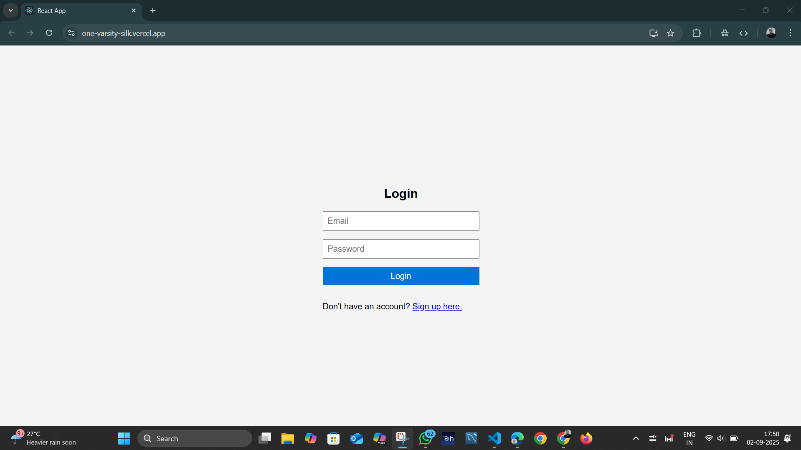
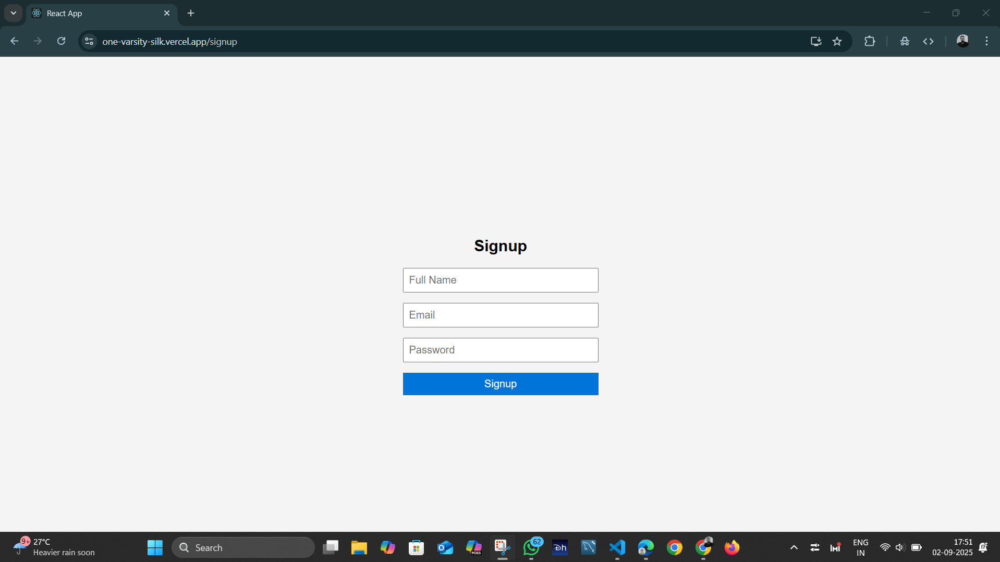
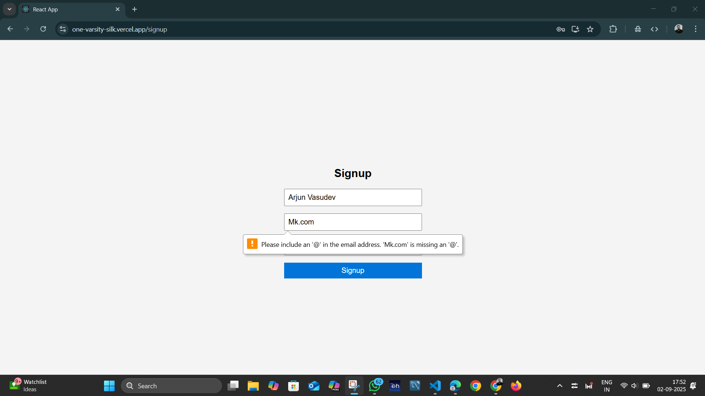
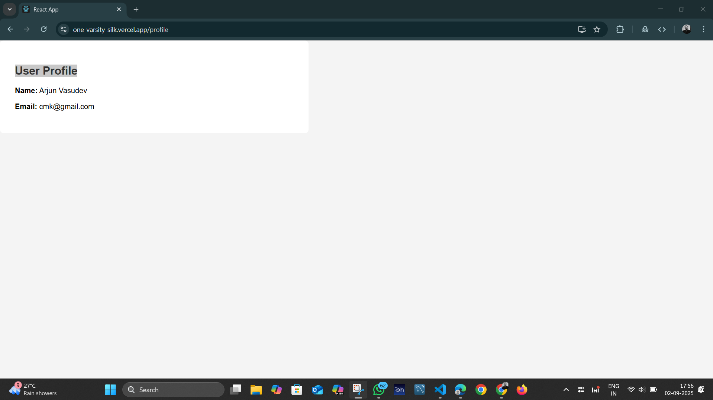
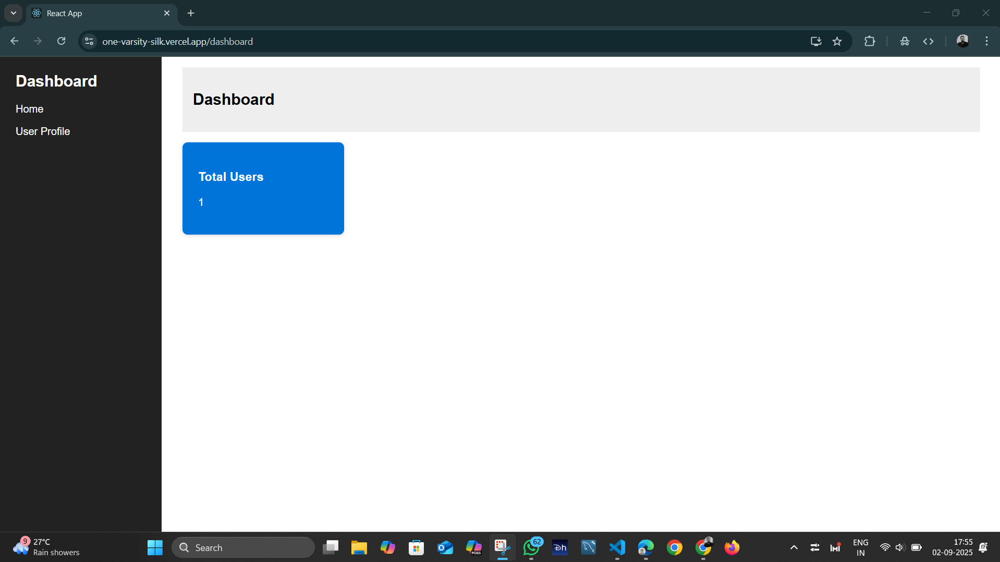
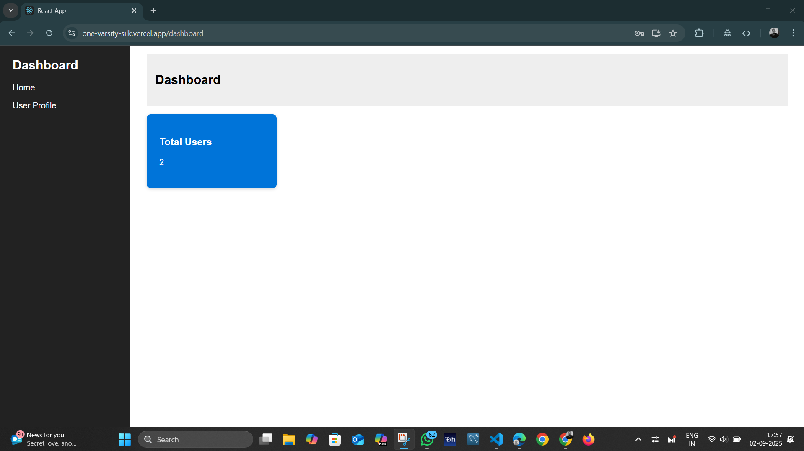

## Table of Contents
- [Features](#features)
- [Setup Instructions](#setup-instructions)
- [Getting Started](#getting-started)
- [Live Deployments](#live-deployments)
- [Usage](#usage)
- [Project Structure](#project-structure)
- [Screenshots](#screenshots)
- [Demo Video](#demo-video)

# 📊 React Dashboard Application

A responsive **frontend dashboard application** built with **React.js**, featuring user authentication, a dynamic dashboard, user profile management, and API integration with a mock backend powered by **JSON Server**.

---

## Features

- 🔑 **User Authentication** – Login and Signup with form validation.
- 📊 **Dashboard** – Sidebar navigation, top navbar, and data visualization cards.
- 👤 **User Profile** – Fetches and displays user details dynamically from JSON Server.
- 🔗 **API Integration** – Uses a custom `db.json` as a mock backend.
- 🌍 **State Management** – Global user state handled via **React Context API**.
- 🛣 **Routing** – Client-side navigation using `react-router-dom`.
- 📱 **Responsive Design** – Mobile-friendly layout with **Flexbox** and **media queries**.

---

## Setup Instructions

### ✅ Prerequisites
- [Node.js](https://nodejs.org/) and npm installed.
- [JSON Server](https://github.com/typicode/json-server) installed globally:  
  ```bash
  npm install -g json-server
  ```

## Getting Started

1. **Clone the repository**
  Front-end
   ```bash
   git clone https://github.com/MALLIKHARJUNCH-02/OneVarsity.git
   cd assignment1
   ```

   Back-End
   ```bash
   git clone https://github.com/MALLIKHARJUNCH-02/json-server-assignment1_backend.git
   cd json-server-assignment1_backend
   ```

2. **Install dependencies**
   ```bash
   npm install
   ```

  **For Local Development**
---
3. **Set up JSON Server**
   - Create a file named `db.json` in the project root with the following content:
     ```json
     {
       "users": []
     }
     ```
   - Start JSON Server on port **3001**:
     ```bash
     json-server --watch db.json --port 3001
     ```

4. **Run the React app**
   ```bash
   npm start
   ```
   - App runs on: `http://localhost:3000`  
   - Mock backend runs on: `http://localhost:3001`

---

---
---

## Live Deployments

- **Backend (JSON Server):**  
  🔗 [https://json-server-assignment1-backend.onrender.com](https://json-server-assignment1-backend.onrender.com)

- **Frontend (React App):**  
  🔗 [https://one-varsity-silk.vercel.app/](https://one-varsity-silk.vercel.app/)

---

---
## To Deploy in Local Host
---
Replace the backend url in 
  Login.js
  Signup.js
  Dashboard.js
  Profile.js
add your backend url local host
---

## Usage

- 📝 **Signup** – Create a new user (with email uniqueness check).
- 🔑 **Login** – Authenticate with email & password.
- 📊 **Dashboard** – View sample dashboard data.
- 👤 **Profile** – Fetch and display user details.
- 📱 **Responsive** – Works seamlessly across devices.

---

## Project Structure

```
src/
  ├── App.js
  ├── Login.js
  ├── Signup.js
  ├── Dashboard.js
  ├── Profile.js
  ├── UserContext.js
  ├── styles.css
public/
  ├── index.html
db.json
package.json
README.md
```

---

---

## Screenshots








## Demo Video
[Watch the Demo](https://drive.google.com/file/d/1FmoleG8edRa1YJt1wNKZB21GGCHa_kQF/view?usp=sharing)


## 📝 Notes

- Backend is simulated by **JSON Server** (local only).
- Replace with a real backend for production use.
- This project is intended for **learning & demo purposes**.

---

## 📦 Dependencies

- [React](https://react.dev/)
- [react-router-dom](https://reactrouter.com/)
- [JSON Server](https://github.com/typicode/json-server)

---

## 📜 License

This project is **open-source** and free to use for educational purposes.

---

## 👨‍💻 Author

**[Chilukuri Mallikhajun Reddy]**  
🔗 Replace with your [GitHub Profile](https://github.com/MALLIKHARJUNCH-02)  

---

✨ Thank you for exploring this React Dashboard Application! 🚀
