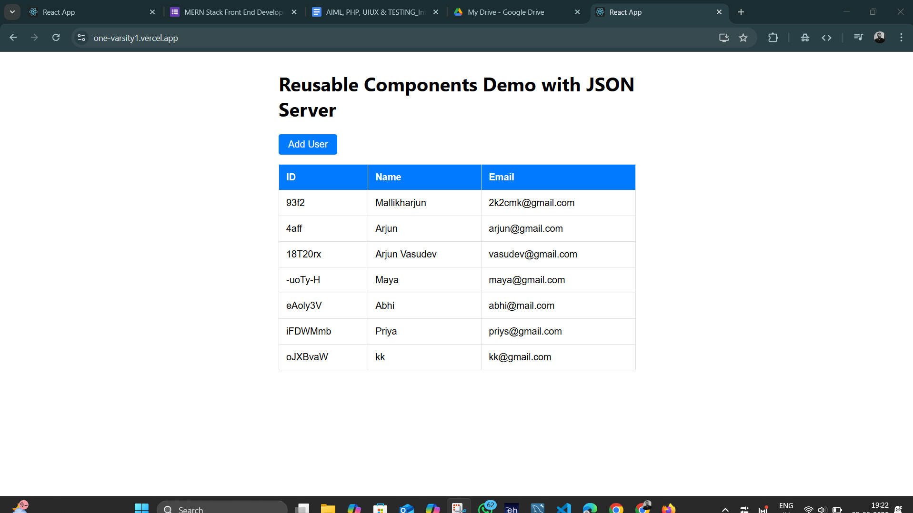
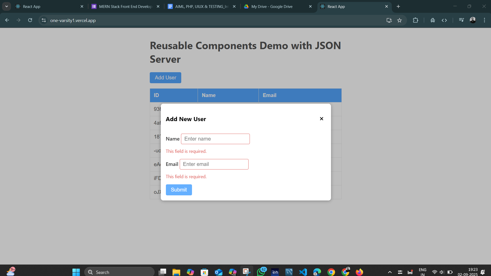
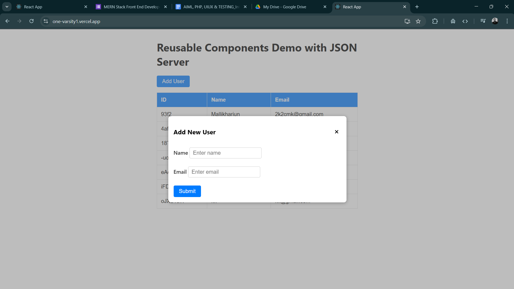

## Table of Contents
- [Features](#features)
- [Getting Started](#getting-started)
- [Installation](#installation)
- [Live Deployments](#live-deployments)
- [Usage](#usage)
- [Project Structure](#project-structure)
- [Screenshots](#screenshots)
- [Demo Video](#demo-video)


# ⚛️ Reusable Components Demo with JSON Server

A React-based demo application showcasing a library of **reusable components** integrated with a **JSON Server backend**. It demonstrates dynamic data fetching, adding new records, and state management with React hooks.

---

## Features

- ♻️ **Reusable React components**
  - Button
  - Modal
  - Form Input
  - Table

- 🔗 **JSON Server Integration**
  - Fetch user data from a mock REST API.
  - Add new users via a modal form with validation.
  - Persist data on the JSON Server backend.

- ✅ **Form Validation**
  - Real-time validation for required fields on name and email inputs.

- ⚡ **Dynamic UI Updates**
  - Table updates immediately after adding new data.
  - Modal dialog for data entry with controlled inputs.

- 🎨 **Scoped Styling**
  - CSS Modules used for each component for maintainability.

---

## Getting Started

### ✅ Prerequisites
- [Node.js](https://nodejs.org/) and npm installed.
- [JSON Server](https://github.com/typicode/json-server) installed globally or locally:
  ```bash
  npm install -g json-server
  ```

### Installation

1. **Clone the repository**
   ```bash
   git https://github.com/MALLIKHARJUNCH-02/OneVarsity1.git
   cd OneVarsity1
   ```

2. **Install dependencies**
   ```bash
   npm install
   ```

3. **Setup JSON Server**
   - Create a `db.json` file in the project root with the following content:
     ```json
     {
       "users": []
     }
     ```
   - Start the JSON Server on port **3001**:
     ```bash
     json-server --watch db.json --port 3001
     ```

4. **Start React development server**
   ```bash
   npm start
   ```
   Open `http://localhost:3000` in your browser.

---


## Live Deployments

- **Backend (JSON Server):**  
  🔗 [https://json-server-assignment2-backend.onrender.com](https://json-server-assignment2-backend.onrender.com)

- **Frontend (React App):**  
  🔗 [https://one-varsity1.vercel.app/](https://one-varsity1.vercel.app/)

## Project Structure

```
src/
  ├─ App.jsx           # Main app with modal, form, table, integration logic
  ├─ Button.jsx        # Reusable button component
  ├─ Modal.jsx         # Reusable modal dialog component
  ├─ FormInput.jsx     # Reusable form input with validation
  ├─ Table.jsx         # Reusable data grid/table component
  ├─ *.module.css      # Component-specific CSS modules for scoped styling
db.json                # JSON Server database file
package.json           # NPM project config & dependencies
README.md              # This file
```

---

## Usage

- Click **Add User** to open the modal dialog.
- Enter **Name** and **Email** to add a new user.
- Submit button is disabled until required fields are valid.
- Newly added users display in the table immediately.
- Data is persisted on JSON Server backend.

---

## Screenshots




## Demo Video
[Watch the Demo](https://drive.google.com/file/d/1XAdYJPrD5PEj28ThFgvsW9y-oRn12bpt/view?usp=sharing)


## Technologies Used

- [React](https://react.dev/) (functional components & hooks)
- [JSON Server](https://github.com/typicode/json-server) (mock REST API backend)
- [CSS Modules](https://github.com/css-modules/css-modules) for component styling
- [PropTypes](https://reactjs.org/docs/typechecking-with-proptypes.html) for prop validation

---

## 📝 Notes

- This project uses **JSON Server** as a simple backend for CRUD operations.  
  For production, it’s recommended to replace with a real backend.
- The modal supports closing by clicking the backdrop or the close button.
- The form provides inline validation and disables submit on errors.

---

## 📜 License

MIT License

---

## 👨‍💻 Author

**[Chilukuri Mallikharjun Reddy]**  
🔗 Replace with your [GitHub Profile](https://github.com/MALLIKHARJUNCH-02)

---

✨ Thank you for exploring this Reusable Components Demo with JSON Server! 🚀
