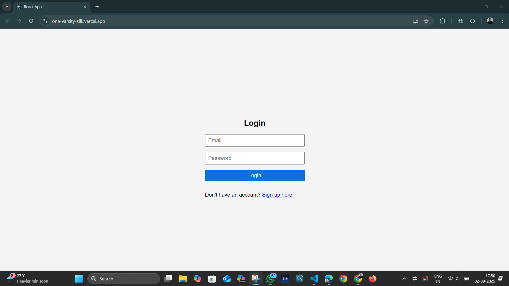
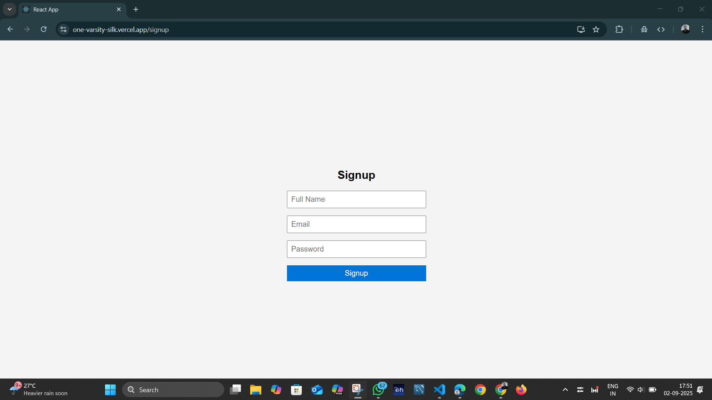
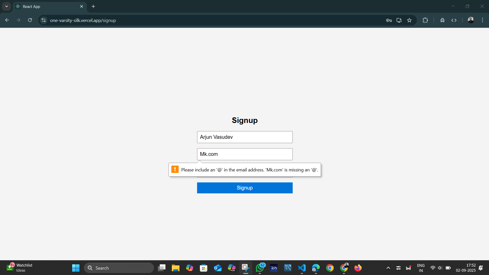
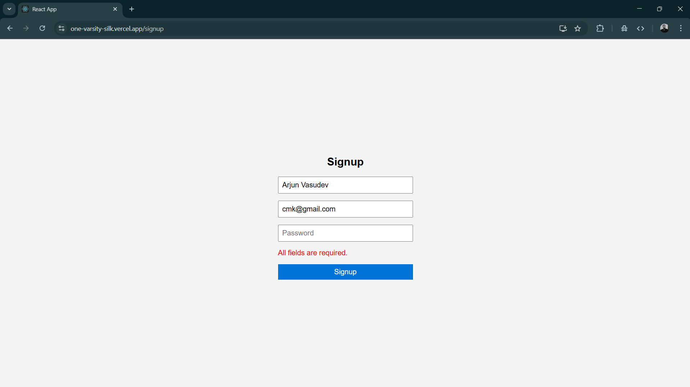
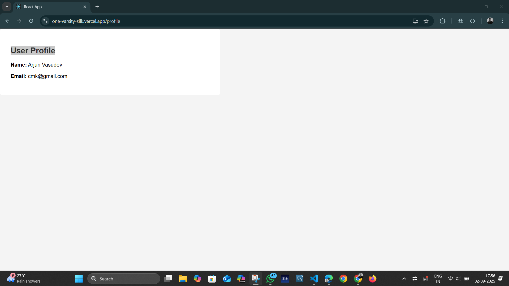
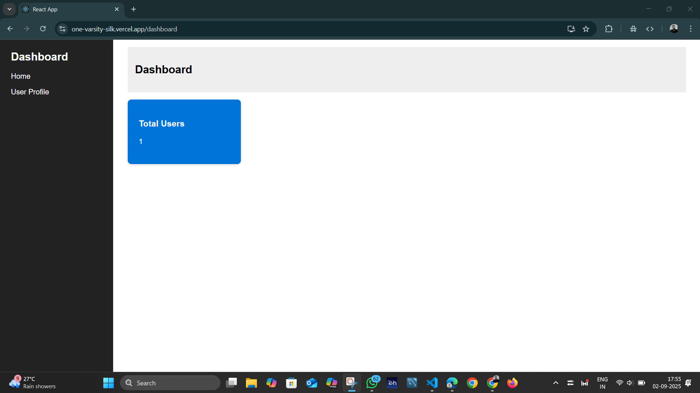
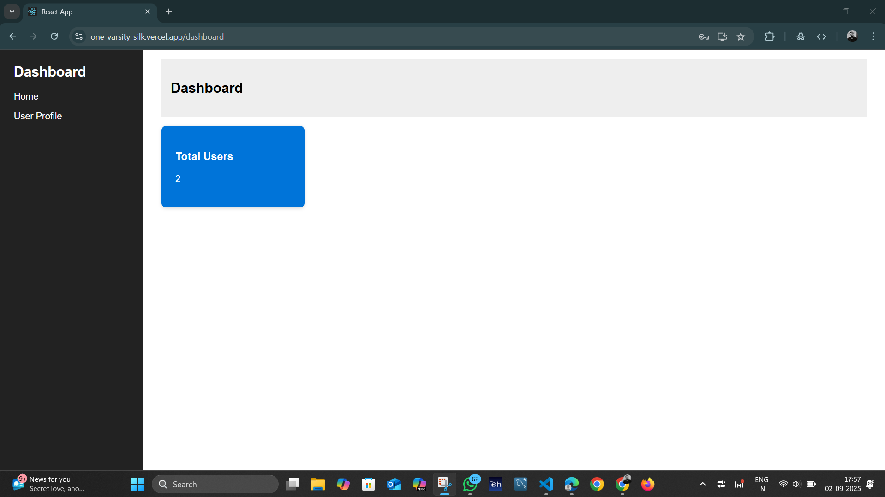
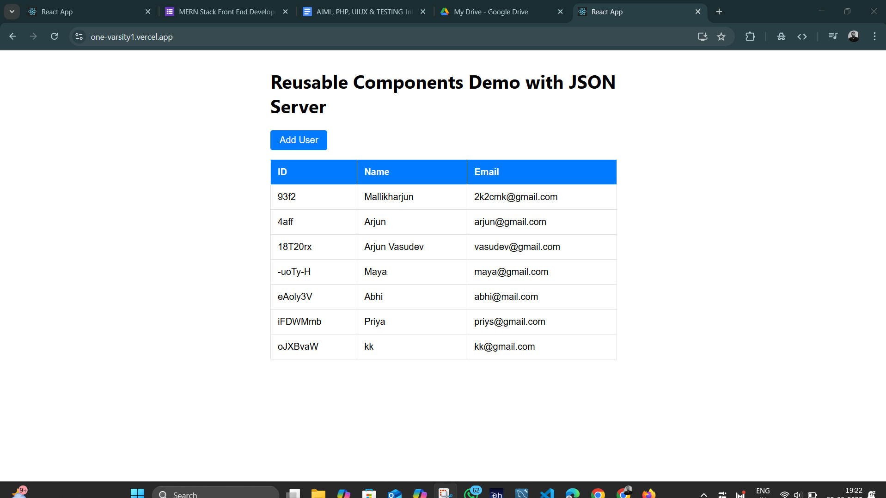
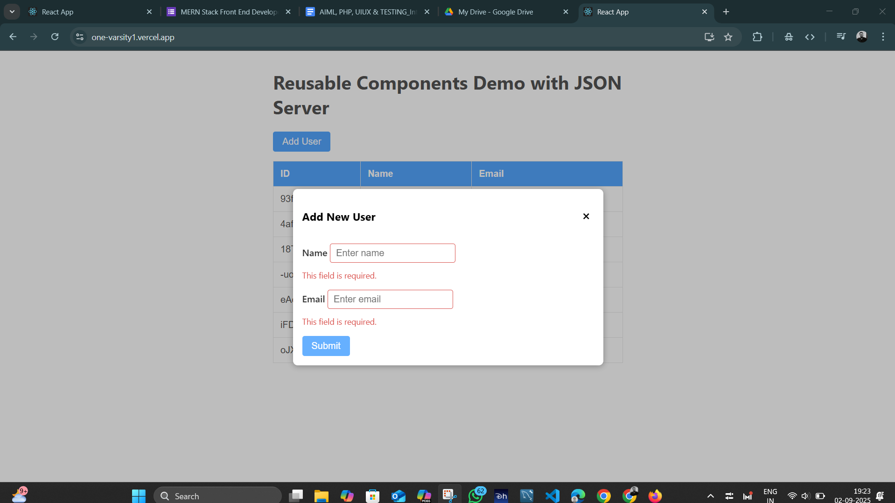
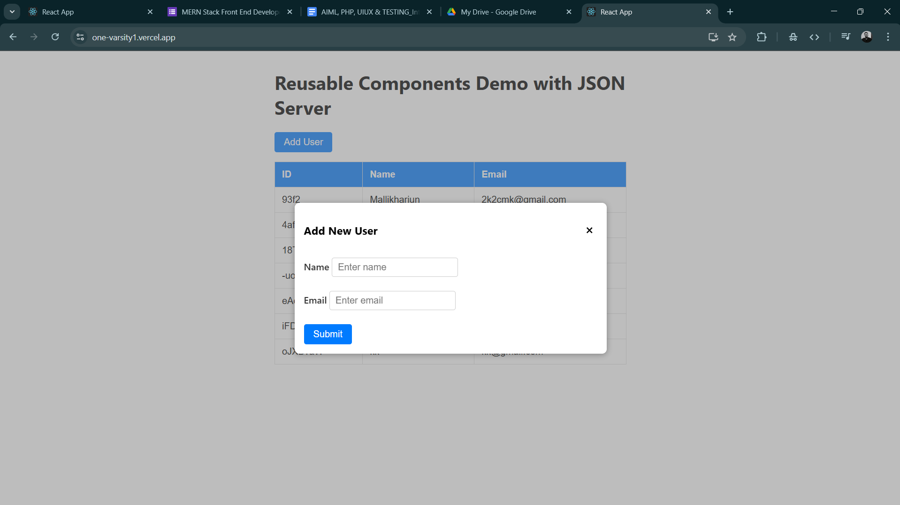

# 📘 Combined Documentation – Assignment 1 & Assignment 2


## Assignment Structure

```
OneVarsity/
  ├── /Mallikharjun
  |      ├── /assignment1
  |      ├── /assignment2
  ├── /json-server-assignment1_backend
  ├── /json-server-assignment2_backend
  ├── * .png
README.md
```

## Table of Contents
- [Assignment 1 – React Dashboard Application](#assignment-1-react-dashboard-application)
  - [Features](#a1-features)
  - [Setup Instructions](#a1-setup-instructions)
  - [Getting Started](#a1-getting-started)
  - [Live Deployments](#a1-live-deployments)
  - [Usage](#a1-usage)
  - [Project Structure](#a1-project-structure)
  - [Screenshots](#a1-screenshots)
  - [Demo Video](#a1-demo-video)
- [Assignment 2 – Reusable Components Demo](#assignment-2-reusable-components-demo-with-json-server)
  - [Features](#a2-features)
  - [Getting Started](#a2-getting-started)
  - [Installation](#a2-installation)
  - [Live Deployments](#a2-live-deployments)
  - [Usage](#a2-usage)
  - [Project Structure](#a2-project-structure)
  - [Screenshots](#a2-screenshots)
  - [Demo Video](#a2-demo-video)
- [Author](#author)

---

# Assignment 1 – React Dashboard Application

A responsive **frontend dashboard** built with **React.js**, featuring user authentication, a dynamic dashboard, user profile management, and API integration with **JSON Server**.

<a id="a1-features"></a>
## Features
- 🔑 User Authentication (Login & Signup)
- 📊 Dashboard with sidebar, navbar, cards
- 👤 User Profile (data from JSON Server)
- 🔗 API Integration with `db.json`
- 🌍 Context API for global state
- 🛣 Routing with `react-router-dom`
- 📱 Responsive Design

<a id="a1-setup-instructions"></a>
## Setup Instructions

### ✅ Prerequisites
- Node.js & npm installed
- JSON Server installed globally:
  ```bash
  npm install -g json-server

<a id="a1-getting-started"></a>

## Getting Started

### 1) Clone the repositories

**Frontend**

```bash
git clone https://github.com/MALLIKHARJUNCH-02/OneVarsity.git
cd assignment1
```

**Backend**

```bash
git clone https://github.com/MALLIKHARJUNCH-02/json-server-assignment1_backend.git
cd json-server-assignment1_backend
```

### 2) Install dependencies

```bash
npm install
```

### 3) Set up JSON Server

Create `db.json` in the backend root:

```json
{
  "users": []
}
```

Start JSON Server on **3001**:

```bash
json-server --watch db.json --port 3001
```

> If running locally, update your frontend API base URL to `http://localhost:3001`.

### 4) Run the React app

```bash
npm start
```

* Frontend → `http://localhost:3000`
* Backend → `http://localhost:3001`

<a id="a1-live-deployments"></a>

## Live Deployments

* **Backend:** [https://json-server-assignment1-backend.onrender.com](https://json-server-assignment1-backend.onrender.com)
* **Frontend:** [https://one-varsity-silk.vercel.app/](https://one-varsity-silk.vercel.app/)

<a id="a1-usage"></a>

## Usage

* 📝 **Signup** to create a user (unique email)
* 🔑 **Login** with email & password
* 📊 **Dashboard** to view sample data
* 👤 **Profile** to fetch/display user details

<a id="a1-project-structure"></a>

## Project Structure

```
src/
  ├── App.js
  ├── Login.js
  ├── Signup.js
  ├── Dashboard.js
  ├── Profile.js
  ├── UserContext.js
  ├── styles.css
public/
  ├── index.html
db.json
package.json
README.md
```

<a id="a1-screenshots"></a>

## Screenshots









<a id="a1-demo-video"></a>

## Demo Video

[🎥 Watch the Demo](https://drive.google.com/file/d/1FmoleG8edRa1YJt1wNKZB21GGCHa_kQF/view?usp=sharing)

---

# Assignment 2 – Reusable Components Demo with JSON Server

A React demo showcasing **reusable components** with a **JSON Server** backend: dynamic data fetching, adding records, and state management with hooks.

<a id="a2-features"></a>

## Features

* ♻️ Reusable Components: Button, Modal, Form Input, Table
* 🔗 JSON Server Integration (mock REST API)
* ✅ Real-time validation (Name & Email)
* ⚡ Immediate UI updates after adding data
* 🎨 Scoped styling with CSS Modules

<a id="a2-getting-started"></a>

## Getting Started

### ✅ Prerequisites

* Node.js & npm
* JSON Server installed:

  ```bash
  npm install -g json-server
  ```

<a id="a2-installation"></a>

## Installation

```bash
git clone https://github.com/MALLIKHARJUNCH-02/OneVarsity1.git
cd OneVarsity1
npm install
```

### Setup JSON Server

Create `db.json`:

```json
{
  "users": []
}
```

Run JSON Server on **3001**:

```bash
json-server --watch db.json --port 3001
```

> For local dev, point the frontend API to `http://localhost:3001`.

Start React app:

```bash
npm start
```

<a id="a2-live-deployments"></a>

## Live Deployments

* **Backend:** [https://json-server-assignment2-backend.onrender.com](https://json-server-assignment2-backend.onrender.com)
* **Frontend:** [https://one-varsity1.vercel.app/](https://one-varsity1.vercel.app/)

<a id="a2-usage"></a>

## Usage

* Click **Add User** to open modal
* Enter **Name** and **Email** (validated)
* Submit when valid → Table updates instantly
* Data persists in JSON Server

<a id="a2-project-structure"></a>

## Project Structure

```
src/
  ├─ App.jsx
  ├─ Button.jsx
  ├─ Modal.jsx
  ├─ FormInput.jsx
  ├─ Table.jsx
  ├─ *.module.css
db.json
package.json
README.md
```

<a id="a2-screenshots"></a>

## Screenshots





<a id="a2-demo-video"></a>

## Demo Video

[🎥 Watch the Demo](https://drive.google.com/file/d/1XAdYJPrD5PEj28ThFgvsW9y-oRn12bpt/view?usp=sharing)

---

## Author

👨‍💻 **Chilukuri Mallikharjun Reddy**
🔗 [https://github.com/MALLIKHARJUNCH-02](https://github.com/MALLIKHARJUNCH-02)
